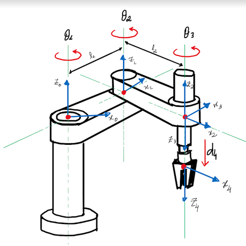
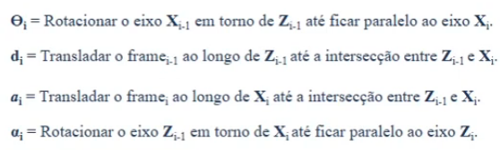
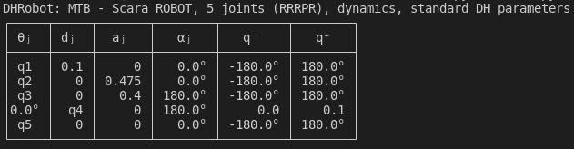
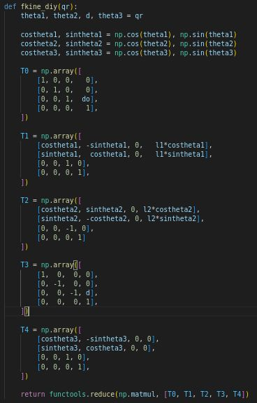
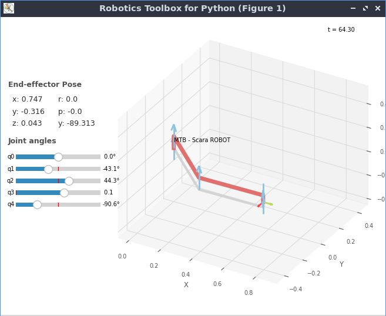
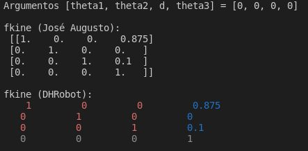
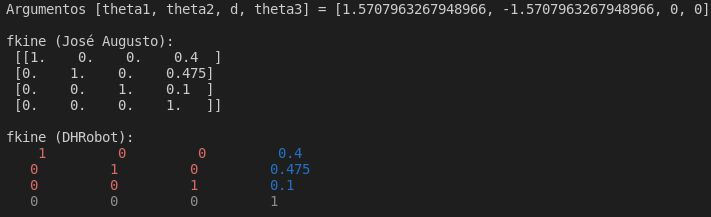
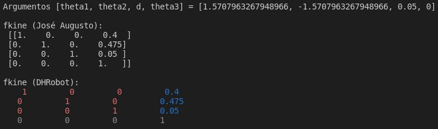
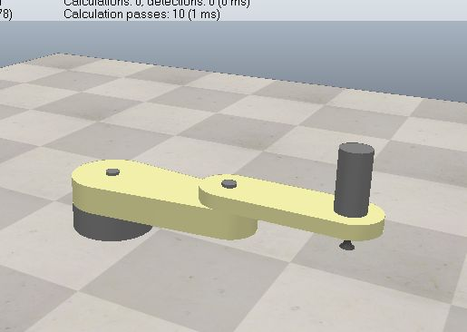
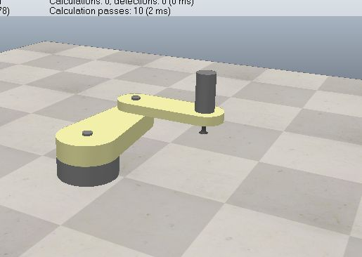

# Atividade 2 de Robótica, por José Augusto dos Santos Silva

## Cinemática Direta para o Robô SCARA utilizando parâmetros de Denavit-Hartenberg

Regras dos Parâmetros DH | Eixos SCARA
:---------------------------:|:-------------------------:
  |  

### Constantes do problema:

- $d_{offset} = 0.1 m$;
- $l_1 = 0.475 m$;
- $l_2 = 0.4 m$;
- $0 m \leq ^{4}d \leq 0.1 m$.

1. A tabela de parâmetros DH

    

    No código, foi adicionado mais uma junta de revolução na origem com o parâmetro $d = d_{offset} = 0.1 m$ para não ter que fazer uma translação no eixo $y$ na fkine do DHRobot.

    Também preferi re-definir $z_2$ para baixo, já que a junta prismática é a terceira junta do Scara no coppeliaSim. Também redefini os eixos de $z_3$ e $z_4$ na ponta efetuador, por isso foi necessário as duas rotações de $\pi$ em $\alpha_2$ e $\alpha_3$.

2. Cálculo das matrizes de transformação até o efetuador

    Seja 
    $$T_{i}^{i-1} = \begin{bmatrix}
       cos(\theta_i) & -sin(\theta_i)cos(\alpha_i)  &  sin(\theta_i)sin(\alpha_i) & a_{i}cos(\theta_i)
    \\ sin(\theta_i) &  cos(\theta_i)cos(\alpha_i)  & -cos(\theta_i)sin(\alpha_i) & a_{i}sin(\theta_i)
    \\ 0             &  sin(\alpha_i)               &  cos(\alpha_i)              & d_i
    \\ 0             &  0                           &  0                          & 1
    \end{bmatrix}$$
    a matriz de transformação homogênia que rotaciona em $z$, translação em $z$, translação em $x$ e rotação em $x$ entre os frames $i$ e $i-1$ a partir dos parâmetros DH estabelecidos. Segue abaixo as matrizes de transformação homogênia para cada par sequencial de referências. Observe que, pelo fato de ter que colocar uma junta na origem, com nenhum parâmetro variável apenas com $d = d_{offset}$, teremos, excepcionalmente, uma matriz $T_0$ para fazer este ajuste.

    $$T_{0} = \begin{bmatrix}
       cos(\theta_0) & -sin(\theta_0)cos(\alpha_0)  &  sin(\theta_0)sin(\alpha_0) & a_{i}cos(\theta_0)
    \\ sin(\theta_0) &  cos(\theta_0)cos(\alpha_0)  & -cos(\theta_0)sin(\alpha_0) & a_{i}sin(\theta_0)
    \\ 0             &  sin(\alpha_0)               &  cos(\alpha_0)              & d_{offset}
    \\ 0             &  0                           &  0                          & 1
    \end{bmatrix} = \begin{bmatrix}
       1 & 0 & 0 & 0
    \\ 0 & 1 & 0 & 0
    \\ 0 & 0 & 1 & 0.1
    \\ 0 & 0 & 0 & 1
    \end{bmatrix}$$

    $$T_{1}^{0} = \begin{bmatrix}
       cos(\theta_1) & -sin(\theta_1)  &  0 & l_{1}cos(\theta_1)
    \\ sin(\theta_1) &  cos(\theta_1)  &  0 & l_{1}sin(\theta_1)
    \\ 0             &  0              &  1 & 0
    \\ 0             &  0              &  0 & 1
    \end{bmatrix} = \begin{bmatrix}
       cos(\theta_1) & -sin(\theta_1)  &  0 & 0.475cos(\theta_1)
    \\ sin(\theta_1) &  cos(\theta_1)  &  0 & 0.475sin(\theta_1)
    \\ 0             &  0              &  1 & 0
    \\ 0             &  0              &  0 & 1
    \end{bmatrix}$$

    $$T_{2}^{1} = \begin{bmatrix}
       cos(\theta_2) &  sin(\theta_2)  &  0              & l_{2}cos(\theta_2)
    \\ sin(\theta_2) & -cos(\theta_2)  &  0              & l_{2}sin(\theta_2)
    \\ 0             &  0              &  -1  & 0
    \\ 0             &  0              &  0              & 1
    \end{bmatrix} = \begin{bmatrix}
       cos(\theta_2) &  sin(\theta_2)  &  0              & 0.4cos(\theta_2)
    \\ sin(\theta_2) & -cos(\theta_2)  &  0              & 0.4sin(\theta_2)
    \\ 0             &  0              &  -1  & 0
    \\ 0             &  0              &  0              & 1
    \end{bmatrix}$$

    $$T_{3}^{2} = \begin{bmatrix}
       cos(\theta_3) & -sin(\theta_3)cos(\alpha_3)  &  sin(\theta_3)sin(\alpha_3) & a_{3}cos(\theta_3)
    \\ sin(\theta_3) &  cos(\theta_3)cos(\alpha_3)  & -cos(\theta_3)sin(\alpha_3) & a_{3}sin(\theta_3)
    \\ 0             &  sin(\alpha_3)               &  cos(\alpha_3)              & d_3
    \\ 0             &  0                           &  0                          & 1
    \end{bmatrix} = \begin{bmatrix}
       1 &  0 &  0 & 0
    \\ 0 & -1 &  0 & 0
    \\ 0 &  0 & -1 & ^{4}d
    \\ 0 &  0 &  0 & 1
    \end{bmatrix}$$

    $$T_{4}^{3} = \begin{bmatrix}
       cos(\theta_4) & -sin(\theta_4)cos(\alpha_4)  &  sin(\theta_4)sin(\alpha_4) & a_{4}cos(\theta_4)
    \\ sin(\theta_4) &  cos(\theta_4)cos(\alpha_4)  & -cos(\theta_4)sin(\alpha_4) & a_{4}sin(\theta_4)
    \\ 0             &  sin(\alpha_4)               &  cos(\alpha_4)              & d_4
    \\ 0             &  0                           &  0                          & 1
    \end{bmatrix} = \begin{bmatrix}
       cos(\theta_3) & -sin(\theta_3) & 0 & 0
    \\ sin(\theta_3) &  cos(\theta_3) & 0 & 0
    \\ 0             &  0             & 1 & 0
    \\ 0             &  0             & 0 & 1
    \end{bmatrix}$$

3. Código da função de cinemática direta fkine

    

4. Print do objeto SerialLink gerado na robotics toolbox

    

5. Comparação do resultado da função fkine implementada e a função fkine dentro do objeto SerialLink gerado para as seguintes configurações:
   1. $\theta_1 = 0$; $\theta_2 = 0$; $\theta_3 = 0$; $^{4}d = 0$

        

   2. $\theta_1 = \frac{\pi}{2}$; $\theta_2 = -\frac{\pi}{2}$; $\theta_3 = 0$; $^{4}d = 0$

        

   3. $\theta_1 = \frac{\pi}{2}$; $\theta_2 = -\frac{\pi}{2}$; $\theta_3 = 0$; $^{4}d = 0.05$

        

   4. Enviar comandos para o CoppeliaSIM

        Primeiro comando $\theta_1 = 0$; $\theta_2 = 0$; $\theta_3 = 0$; $^{4}d = 0$:

        

        Segundo comando $\theta_1 = \frac{\pi}{2}$; $\theta_2 = -\frac{\pi}{2}$; $\theta_3 = 0$; $^{4}d = 0$:

        

        Terceiro comando $\theta_1 = \frac{\pi}{2}$; $\theta_2 = -\frac{\pi}{2}$; $\theta_3 = 0$; $^{4}d = 0.05$:

        